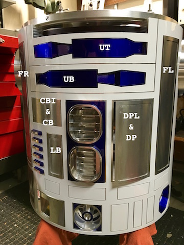

#<a name="r2fx-ino"></a>R2FX.ino

This software is used to control the auxilary functions in an astromech.  Control over compnonents like a panel or lighting system may be directly controlled through here, however more importantly the goal of this project is to expose the capability of creating new sequences and sharing them with other astromech builders. 


- [Hardware](#r2fx-hardware) - A description of the hardware necessary to run R2FX.
- [R2FXConfig.h](#r2fx-configuration) - Contains all of the configurations used to build the project. This is the only file that **needs** be edited by end users.
- [R2FX ASCII Protocol](#r2fx-ascii-protocol), [R2FX Byte Protocol](#r2fx-byte-protocol) - A description of the protocols used to communicate to the R2FX control system.
- [Sequence Storage (R2FS)](#r2fx-r2fs) - A description of how R2FX sequences are stored and retrieved.

###<a name="r2fx-hardware"></a>Hardware


- [Bluefruit Shield](https://www.adafruit.com/products/2746)
- [32Kb I2C FRAM Chip](https://www.adafruit.com/products/1895)
- [Arduino Uno](https://www.adafruit.com/products/50) or compatble board.
- [Adafruit I2C Servo Driver](https://www.adafruit.com/products/815)

###<a name="r2fx-ascii-protocol"></a>R2FX ASCII Protocol _[..](#r2fx-ino)_

An ASCII based protocol to interact with the R2FX system.  While this protocol provides an 'simpler and easier' way of issuing commands, it will only ever exist for testing and demo purposes and most likely will never be a complete implementation of the prefferred byte based protocol which is more robust, concise and allows for 'sequences' of commands to be stored in FRAM.

R2FX serial messages contain a command, followed by any possible parameters and can total up to 16 bytes in length.  (Keep in mind, the messages use 2 bytes each to START and END a message.) Theorectically, the mininum length of message is 3 bytes, in practice it's much more.

An example of it's usage can be found below, here we are closing the center pie panel while opening up the PP1 to it's fullest setting.

```

[PPC0][PP180]

```
In addition to sending messages, the protocol also returns reponses.  A R2FX ASCII response will contain one or more lines, followed by an exit message of either `OK` or `ERR`.  If entered into a terminal, these are some of the responses you may get.

```
// close the center panel
> [PPC0]
PPC
OK

// move to 80 degrees
> [PP180]
PP1
OK

// Unmapped command
> [FOO-BAR]
ERR
```

##### Dome Systems _[..](#r2fx-ascii-protocol)_
Command          | Description                         | Parameters                   | Example
:----------------|:------------------------------------|:-----------------------------|---------
`PPC`            | center pie panel                    | `null` or `0-127` (null == 0)| `[PPC90]`
`PP(1,2,5,6)`    | pie panels #1,2,3,5,6               | ...                          | `[PP1]`
`P(1-4)|(7,8,A)`| panel #1-4, or 7, 8, A (Hex for 10) | ...                          | `[PA0]`

##### Body Systems _[..](#r2fx-ascii-protocol)_

Body sytem commands cover lighting, non directional movement, servos and more beneath the dome.  To illustrate the abbreviated terms to locations on the astromech see the picture below.  The names of these components are used to control the astromech using the ASCII based protocol.



Command          | Description                         | Parameters                   | Example
:----------------|:------------------------------------|:-----------------------------|---------
`U(T|B)`         | sets the position of the utility arms T=top, B=bottom | `null` or `0-127` (null == 0)| `[UT127]`
`CBI`             | enables or disables the charge bay indicator panel , returns it's enabled state| `null` to set to false, or boolean `0|1` | `[CBI]`
`CB`             | sets the door position on the charge bay, opening this door will cause the CBI to be enabled automatically | `null` or `0-127` (null == 0)| `[CB127]`
`DPL`			    | enables or disables the data port logics, returns it's state | `null` to set to false, or boolean `0|1` | `[DPL]`
`DP`             | sets the door position of the data port, opening this door will cause the DPL to be enabled | `null` or `0-127` (null == 0) | `[DPL127]`
`LB`             | sets the door position of the lower charge bay |`null` or `0-127` (null == 0)| `[LB127]`
`FR`             | sets the door position of the front right door |`null` or `0-127` (null == 0)| `[FR]`
`FL`             | sets the door position of the front left door |`null` or `0-127` (null == 0)| `[FL90]`
`RR`             | sets the door position of the rear right door |`null` or `0-127` (null == 0)| `[RR127]`
`RL`             | sets the door position of the reat left door |`null` or `0-127` (null == 0)| `[RL15]`


##### System Commands _[..](#r2fx-ascii-protocol)_
Command          | Description                         | Parameters                   | Example
:----------------|:------------------------------------|:-----------------------------|---------
`V(P|D)`         | prints the current voltage level in decimal (D) or percent (P) | `null` | `[VP]`
                                                       
###<a name="r2fx-byte-protocol"></a>R2FX Byte Protocol _[..](#r2fx-ino)_
>_---Work in progress----_

[Message](#r2fx-byte-message)  | [CRC](#r2fx-byte-crc)  |  [Reserved Command Ranges](#r2fx-reserved-commands)  |  [Dome Systems]()  |  [Body Systems]()  |  [Audio Systems]()  | [R2FX Management]()


A R2FX command and its data parameters are refferred to as an R2FX message . The minimum size of a message is 3 bytes *(one command byte, a length parameter signed 8 bit integer (-1) with no parameter (data) bytes), and a CRC field*. The maximum size of a R2FX message currently can be up to 16 bytes, however in practice this should rarely happen and in theory could be expanded to 130 bytes (CMD + LEN + 127 bytes + CRC). 

An R2FX message **always** starts with a command byte. The table below outlines the possible command types that may be used when using R2FX.

#####<a name="r2fx-byte-message"></a> R2FX Message Format _[..](#r2fx-byte-protocol)_
```

         CMD.,  LEN.,  DATA..............,  CRC
         0xF0,  0x03,  0xA1,  0xC1,  0xF7,  0xCC
         |_______________________________|
                       | |
       CRC computed from the complete packet.    
            
```

#####<a name="r2fx-byte-crc"></a> R2FX CRC _[..](#r2fx-byte-protocol)_

```
const byte CRC_INIT = 0xF0;
const byte CRC_POLY = 0x07;

unsigned byte crc_calc(unsigned byte buffer[], byte size) {
  unsigned long i;
  unsigned byte crc;

  crc = CRC_INIT;

  for (i=0;i<size * 8;i++) {
    crc = (crc << 1) | (crc >> (7));
    if (buffer[i/8] & (0x80 >> (i%8))) {
      crc ^= CRC_POLY;
    }
  }
  return crc;
}
```


#####<a name="r2fx-reserved-commands"></a> Reserved Command Ranges _[..](#r2fx-byte-protocol)_
The ranges in the command space are reserved or restricted for groups of systems, compatibility reasons, or future expansion.

Range (HEX) | Range (DEC) | Purpose
:-----------|:-----------:|:----------
`0x00-0x5A` |    0-90     | tbd
`0x5B`      |     91      | restricted to maintain compatibility with R2FX serial based protocol
`0x5C`      |     92      | restricted
`0x5D`      |     93      | restricted to maintain compatibility with R2FX serial based protocol
`0x5E-0x79` |    94-126   | tbd
`0x80-0xB2` |   127-178   | reserved for Dome FX systems
`0xB3-0xDA` |   179-219   | reserved for Body FX systems
`0xDB-0xEF` |   220-239   | reserved for Audio FX systems
`0xF0-0xFF` |   240-255   | reserved for R2FX managment and telemetry


#####<a name="r2fx-byte-dome"></a> Dome Systems _[..](#r2fx-byte-protocol)_

| Command | Description | Length | Parameters  <br>*0-13 bytes* 
:---------|:------------|:-------|:-----------------------------
 `0x80`   |             |   0    |        ...     
 
#####<a name="r2fx-byte-body"></a> Body Systems _[..](#r2fx-byte-protocol)_

| Command | Description | Length | Parameters  <br>*0-13 bytes* 
:---------|:------------|:-------|:-----------------------------
 `0xB3`   |             |   0    |        ...     


#####<a name="r2fx-byte-audio"></a> Audo Systems _[..](#r2fx-byte-protocol)_

| Command | Description | Length | Parameters  <br>*0-13 bytes* 
:---------|:------------|:-------|:-----------------------------
 `0xDB`   |             |   0    |        ...     
 
#####<a name="r2fx-byte-t2fx"></a> R2FX Systems _[..](#r2fx-byte-protocol)_

| Command | Description | Length | Parameters  <br>*0-13 bytes* 
:---------|:------------|:-------|:-----------------------------
 `0xB3`   |             |   0    |        ...     

###<a name="r2fx-r2fs"></a>Storage of Sequences via FRAM Module _[..](#r2fx-ino)_ 

Storage and retrieval of R2FX sequences use FRAM. This avoids the need to allocate a large buffer to read SD cards, while also sequences to written over and over without the worry of damaging the chip (EEPROM).  Due to the limited amount of space (32k), sequences are stored in the binary format using R2FS, a simple file system targeted towards efficient management of astromech sequences and other file based needs.

#### Visual Representation of R2FS _[..](#r2fx-r2fs)_ 

```

C = configuration block
A = file allocation entry
F = file entries
D = data clusters 

-------------------- 32 kB Memory Chip ---------------------
CAAAAAAAAAAAAAAAAAAAAAAAAAAAAAAAAAAAAAAAAAAAAAAAAAAAAAAAAAAA
AAAAAAAAAAAAAAAAAAAAAAAAAAAAAAAAAAAAAAAAAAAAAAAAAAAAAAAAAAAA
AFFFFFFFFFFFFFFFFFFFFFFFFFFFFFFFFFFFFFFFFFFFFFFFFFFFFFFFFFFF
FFFFFFFFFFFFFFFFFFFFFFFFFFFFFFFFFFFFFFFFFFFFFFFFFFFFFFFFFFFF
FFFFDDDDDDDDDDDDDDDDDDDDDDDDDDDDDDDDDDDDDDDDDDDDDDDDDDDDDDDD
DDDDDDDDDDDDDDDDDDDDDDDDDDDDDDDDDDDDDDDDDDDDDDDDDDDDDDDDDDDD
... x 26 more kB of data.

(Each cell represents 16 bytes, each row represents 1 kilo byte)

```

##### Config Block 16 bytes 0x00-0x0F _[..](#r2fx-r2fs)_ 
Offset | Length   | Description
-------|----------|-------------
0x00   | 1 byte   | version (1)
0x01   | 1 byte   | number of bytes per block (default 8)
0x02   | 1 byte   | number of blocks per cluster (default 4)
0x03   | 2 bytes  | start cluster
0x05   | 2 bytes  | number of clusters (1000)
0x07   | 2 bytes  | size of device (32,000 bytes)
0x09   | 2 bytes  | number of files
Data Start

##### File Allocation Entry 0x10-0x7DA _(2kB for 32kB device)_ _[..](#r2fx-r2fs)_ 
Offset | Length   | Description
-------|----------|-------------
0x00   | 2 bytes  | Next cluster (0x0001 if end of file)


##### File Entries 0x7DB-0xFDA _(2048 bytes for 128 files)_ _[..](#r2fx-r2fs)_ 
Offset | Length   | Description
-------|----------|-------------
0x00   | 1 byte   | unique file ID (1-255)
0x08   | 1 byte   | file type
0x09   | 8 bytes  | file name
0x0A   | 2 bytes  | reserved
0x0C   | 2 bytes  | start cluster
0x1E   | 2 bytes  | file size in bytes
 
##### Data Clusters 0xFDB-0x7CF0 _[..](#r2fx-r2fs)_ 
Offset | Length   | Description
-------|----------|-------------
0x00   | 16 bytes | data...

 